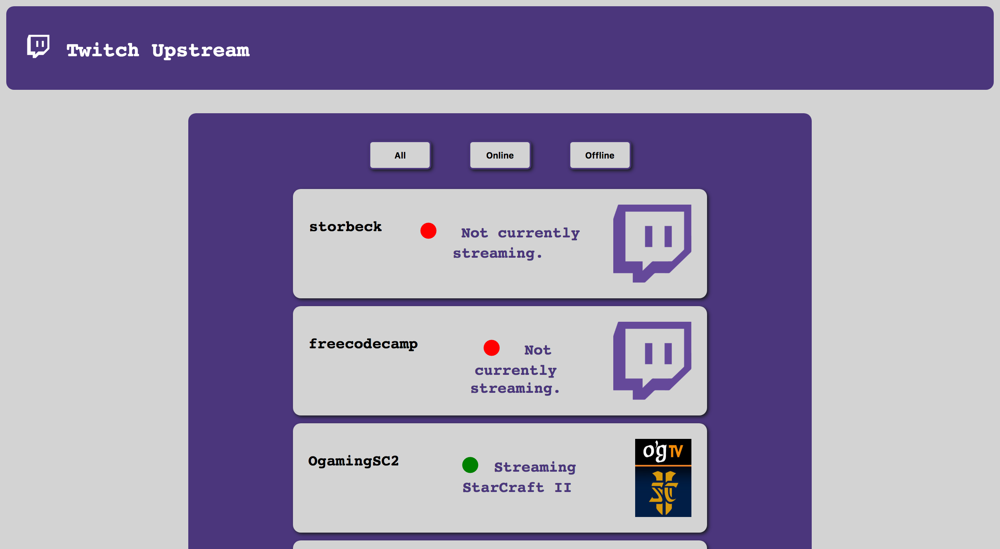

# FCC_Twitch
This is my Twitch API project for Free Code Camp. 

## Live demo
[Twitch Viewer Demo](https://rmcavin.github.io/FCC_Twitch/)

## Free Code Camp Project Link
[Free Code Camp Project Description](https://www.freecodecamp.org/challenges/use-the-twitchtv-json-api)

## Project Requirements
* **User Story:** I can see whether Free Code Camp is currently streaming on Twitch.tv.

* **User Story:** I can click the status output and be sent directly to the Free Code Camp's Twitch.tv channel.

* **User Story:** if a Twitch user is currently streaming, I can see additional details about what they are streaming.
